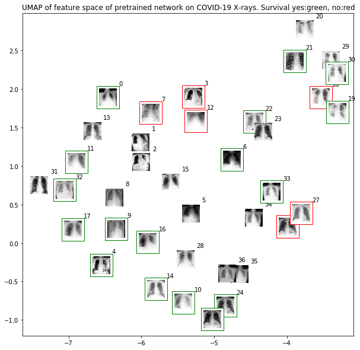

## COVID-19 image data collection

We are building a database of COVID-19 cases with chest X-ray or CT images. We are looking for COVID-19 cases as well as [MERS](https://en.wikipedia.org/wiki/Middle_East_respiratory_syndrome), [SARS](https://en.wikipedia.org/wiki/Severe_acute_respiratory_syndrome), and [ARDS](https://en.wikipedia.org/wiki/Acute_respiratory_distress_syndrome). 

All images and data will be released publicly in this GitHub repo. Currently we are building the database with images from publications as they are images that are already available. 

## View current [images](images) and [metadata](metadata.csv)

Current stats. Labels 0=No or 1=Yes. Data loader is [here](https://github.com/mlmed/torchxrayvision/blob/master/torchxrayvision/datasets.py#L814)
``` 
{'ARDS': {0.0: 75, 1.0: 4},
 'Bacterial Pneumonia': {0.0: 73, 1.0: 6},
 'COVID-19': {0.0: 23, 1.0: 56},
 'MERS': {0.0: 79},
 'No Finding': {0.0: 78, 1.0: 1},
 'Pneumonia': {0.0: 2, 1.0: 77},
 'SARS': {0.0: 68, 1.0: 11},
 'Streptococcus': {0.0: 73, 1.0: 6},
 'Viral Pneumonia': {0.0: 12, 1.0: 67}}
 ```

## Contribute

 - We can extract images from publications. Help identify publications which are not already included using a GitHub issue (DOIs we have are listed in the metadata file).
 
 - Submit data to https://radiopedia.org/ or https://www.sirm.org/category/senza-categoria/covid-19/ (we can scrape the data from them)
 
 - Provide bounding box/masks for the detection of problematic regions in images already collected.

*Formats:* For chest X-ray dcm, jpg, or png are preferred. For CT nifti (in gzip format) is preferred but also dcms. Please contact with any questions.

## Background 
The 2019 novel coronavirus (COVID-19) presents several unique features. While the diagnosis is confirmed using polymerase chain reaction (PCR), infected patients with pneumonia may present on chest X-ray and computed tomography (CT) images with a pattern that is only moderately characteristic for the human eye [Ng, 2020](https://pubs.rsna.org/doi/10.1148/ryct.2020200034). COVID-19’s rate of transmission depends on our capacity to reliably identify infected patients with a low rate of false negatives. In addition, a low rate of false positives is required to avoid further increasing the burden on the healthcare system by unnecessarily exposing patients to quarantine if that is not required. Along with proper infection control, it is evident that timely detection of the disease would enable the implementation of all the supportive care required by patients affected by COVID-19.

In late January, a Chinese team published a paper detailing the clinical and paraclinical features of COVID-19. They reported that patients present abnormalities in chest CT images with most having bilateral involvement [Huang 2020](https://www.thelancet.com/journals/lancet/article/PIIS0140-6736(20)30183-5/fulltext). Bilateral multiple lobular and subsegmental areas of consolidation constitute the typical findings in chest CT images of intensive care unit (ICU) patients on admission [Huang 2020](https://www.thelancet.com/journals/lancet/article/PIIS0140-6736(20)30183-5/fulltext). In comparison, non-ICU patients show bilateral ground-glass opacity and subsegmental areas of consolidation in their chest CT images [Huang 2020](https://www.thelancet.com/journals/lancet/article/PIIS0140-6736(20)30183-5/fulltext). In these patients, later chest CT images display bilateral ground-glass opacity with resolved consolidation [Huang 2020](https://www.thelancet.com/journals/lancet/article/PIIS0140-6736(20)30183-5/fulltext). 

COVID is possibly better diagnosed using radiological imaging [Fang, 2020](https://pubs.rsna.org/doi/10.1148/radiol.2020200432) and [Ai 2020](https://pubs.rsna.org/doi/10.1148/radiol.2020200642).

## Motivation

While PCR tests offer many advantages they are physical things that require shipping the test or the sample. X-ray machines can be plugged in to screen patients as long as they have electricity. 

Imagine a future where we run out of tests and then the majority of radiologists get sick. AI tools can help general practitioners to triage and treat patients.

Companies are developing AI tools and deploying them at hospitals [Wired 2020](https://www.wired.com/story/chinese-hospitals-deploy-ai-help-diagnose-covid-19/). We should have an open database to develop free tools that will also provide assistance.

## Goal

Our goal is to use these images to develop AI based approaches to predict and understand the infection. Our group will work to release these models using our open source [Chester AI Radiology Assistant platform](https://mlmed.org/tools/xray/) which is designed to scale to a global need by performing the computation locally.

Using both X-ray or CT (preference for X-ray) as input to predict these tasks:

- Healthy vs Pneumonia (prototype already implemented [Chester](https://mlmed.org/tools/xray/) with ~74% AUC)

- Bacterial vs Viral vs COVID-19 Pneumonia

- Survival of patient


## Contact
Contact: [Joseph Paul Cohen. Postdoctoral Fellow, Mila, University of Montreal](https://josephpcohen.com/) 

## Initial results


